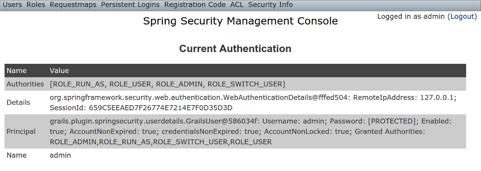

[[configUI]]
== Security Configuration UI

The Security Info menu has links for several pages that contain read-only views of much of the Spring Security configuration:

image::security_info_menu.png[]

=== Security Configuration

The Security Configuration menu item displays all security-related attributes in `application.groovy`. The names omit the `grails.plugin.springsecurity` prefix:

image::security_info_config.png[]

=== Mappings

The Mappings menu item displays the current request mapping mode (Annotation, Requestmap, or Static) and all current mappings:

image::security_info_mappings.png[]

=== Current Authentication

The Current Authentication menu item displays your `Authentication` information, mostly for reference to see what a typical one contains:

=== User Cache

The User Cache menu item displays information about cached users if the feature is enabled (it is disabled by default).

image::security_info_user_cache.png[]

=== Filter Chains

The Filter Chains menu item displays your configured Filter chains. It is possible to have multiple URL patterns each with its own filter chain, for example when using HTTP Basic Auth for a web service. By default since the 3.0.0 release the spring-security-core `s2-quickstart` script configures empty filter chains for static assets to avoid unnecessary security checks (although of course if you need to secure some or all of your static assets you should reconfigure these).

image::security_info_filter_chains.png[]

=== Logout Handlers

The Logout Handlers menu item displays your registered ``LogoutHandler``s. Typically there will be just the ones shown here, but you can register your own custom implementations, or a plugin might contribute more:

image::security_info_logout_handlers.png[]

=== Voters

The Voters menu item displays your registered ``AccessDecisionVoter``s. Typically there will be just the ones shown here, but you can register your own custom implementations, or a plugin might contribute more:

image::security_info_voters.png[]

=== Authentication Providers

The Authentication Providers menu item displays your registered ``AuthenticationProvider``s. Typically there will be just the ones shown here, but you can register your own custom implementations, or a plugin (e.g. LDAP) might contribute more:

image::security_info_providers.png[]

=== Secure Channel Definition

The Secure Channel Definition menu item displays your registered channel security mappings.

image::security_info_secure_channel.png[]
