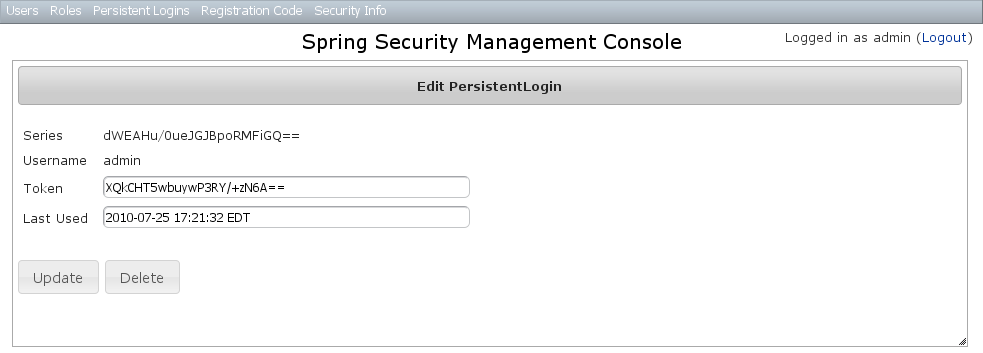

[[persistentCookie]]
== Persistent Cookie Management

Persistent cookies aren't enabled by default - you must enable them by running the `s2-create-persistent-token` script. See https://grails-plugins.github.io/grails-spring-security-core/v3/index.html#rememberMeCookie[the Spring Security Core plugin documentation] for details about this feature.

The Persistent Logins menu is only shown if this feature is enabled.

=== Persistent logins search

The default action for the PersistentLogin controller is search. By default only the standard fields (`username`, `token`, and `series`) are available but this is customizable with the <<s2ui-override>> script - see the <<customization>> section for details.

You can search by any combination of fields, and all fields have an Ajax autocomplete to assist in finding instances. Leave all fields empty to return all instances.

image::persistent_login_search.png[]

Searching is case-insensitive and the search string can appear anywhere in the field. Results are shown paginated in groups of 10 and you can click on any header to sort by that field:

image::persistent_login_search_results.png[]

=== Persistent logins edit

After clicking through to an instance you get to the edit page (there are no view pages):

You can update the `token` or `lastUsed` attribute or delete the instance.

=== Persistent logins creation

Since instances are created during authentication by the spring-security-core plugin, there is no functionality in this plugin to create new instances.
